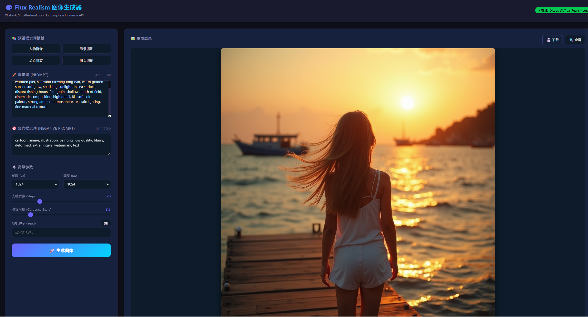
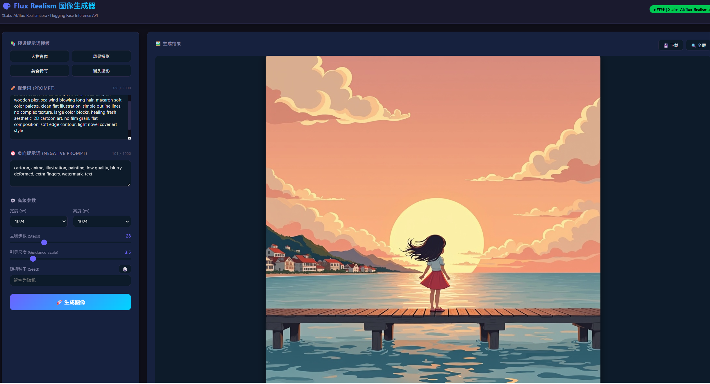

# 软件工程课程第一次个人作业

| 这个作业属于哪个课程 | [202601 软件工程](https://edu.cnblogs.com/campus/fzu/202601SofwareEngineering) |
| :---: | :---: |
| 这个作业要求在哪里 | [第一次个人作业要求](https://edu.cnblogs.com/campus/fzu/202601SofwareEngineering/homework/15712) |
| 这个作业的目标 | 注册并熟悉 GitHub 与博客园平台；调用 HuggingFace API 实现 AI 图像生成并构建前端交互界面；搭建 GitHub 个人主页完成自我介绍与职业规划；梳理个人技能树并制定本学期学习目标 |
| 学号 | 102401129 |

---

## 一、任务一：HuggingFace API 调用 Flux 模型生成图像

### 1.1 准备工作

在 [Hugging Face](https://huggingface.co/) 官网注册个人账号后，进入 **Settings → Access Tokens** 页面创建 API Token。

本次调用的模型为 **XLabs-AI/flux-RealismLora**，该模型基于 Flux 架构，叠加了 Realism LoRA 微调权重，擅长生成贴近真实世界的写实风格图像，符合本次作业"生成一张最贴近真实世界的图像"的要求。

### 1.2 API 调用代码

后端使用 Python + Flask，通过 Hugging Face Inference API 发送 POST 请求，将提示词传递给 Flux 模型，模型返回生成的图像二进制数据。

```python
# app.py — Flask 后端
from flask import Flask, request, jsonify, Response
import requests

app = Flask(__name__)

# Hugging Face 模型推理 API 地址
API_URL = "https://api-inference.huggingface.co/models/XLabs-AI/flux-RealismLora"
# 替换为你自己的 API Token
HEADERS = {"Authorization": "Bearer hf_你的API密钥"}

@app.route("/")
def index():
    """返回前端页面"""
    with open("index.html", encoding="utf-8") as f:
        return f.read()

@app.route("/generate", methods=["POST"])
def generate():
    """接收提示词，调用模型生成图像"""
    data = request.json
    prompt = data.get("prompt", "")
    if not prompt:
        return jsonify({"error": "提示词不能为空"}), 400

    response = requests.post(API_URL, headers=HEADERS, json={"inputs": prompt})

    if response.status_code == 200:
        return Response(response.content, mimetype="image/png")
    else:
        return jsonify({"error": response.text}), 500

if __name__ == "__main__":
    app.run(debug=True, port=5000)
```

### 1.3 前端交互界面

前端使用原生 HTML + JavaScript，包含提示词输入框、生成按钮和图像展示区域，实现用户输入提示词后点击按钮即可交互生成图像。

```html
<!DOCTYPE html>
<html lang="zh-CN">
<head>
    <meta charset="UTF-8">
    <title>Flux RealismLora 图像生成器</title>
    <style>
        body {
            font-family: "Microsoft YaHei", sans-serif;
            max-width: 860px;
            margin: 40px auto;
            background: #f5f5f5;
        }
        h1 { color: #333; }
        textarea {
            width: 100%;
            height: 120px;
            padding: 10px;
            font-size: 14px;
            border: 1px solid #ccc;
            border-radius: 6px;
        }
        button {
            margin-top: 10px;
            padding: 10px 30px;
            background: #2563eb;
            color: #fff;
            border: none;
            border-radius: 6px;
            cursor: pointer;
            font-size: 15px;
        }
        button:hover { background: #1d4ed8; }
        #result {
            max-width: 100%;
            margin-top: 20px;
            border-radius: 8px;
            box-shadow: 0 2px 10px rgba(0,0,0,0.1);
        }
        #status { color: #666; margin-top: 10px; }
    </style>
</head>
<body>
    <h1>🎨 Flux RealismLora 图像生成</h1>
    <p>输入提示词，生成贴近真实世界的图像</p>

    <textarea id="prompt" placeholder="请输入图像描述提示词，例如：A photorealistic photo of a cozy coffee shop interior..."></textarea>
    <br>
    <button onclick="generateImage()">生成图像</button>
    <p id="status"></p>
    

    <script>
    async function generateImage() {
        const prompt = document.getElementById('prompt').value.trim();
        if (!prompt) {
            alert('请先输入提示词');
            return;
        }
        const statusEl = document.getElementById('status');
        const resultEl = document.getElementById('result');
        statusEl.textContent = '⏳ 图像生成中，请稍候...';
        resultEl.src = '';

        try {
            const res = await fetch('/generate', {
                method: 'POST',
                headers: { 'Content-Type': 'application/json' },
                body: JSON.stringify({ prompt: prompt })
            });
            if (!res.ok) throw new Error('生成失败，请检查API密钥或稍后重试');
            const blob = await res.blob();
            resultEl.src = URL.createObjectURL(blob);
            statusEl.textContent = '✅ 生成完成！';
        } catch (e) {
            statusEl.textContent = '❌ ' + e.message;
        }
    }
    </script>
</body>
</html>
```

**运行方式：**

```bash
pip install flask requests
python app.py
```

浏览器访问 `http://127.0.0.1:5000` 即可使用。

### 1.4 提示词设计思路与修改过程

本次目标是"生成一张最贴近真实世界的图像"，因此提示词设计的核心思路是：**固定场景主体 + 分层控制风格**。先确定一个具体、构图完整的画面场景，再通过风格修饰词的不同组合，对比写实风格与卡通风格的输出差异。

#### 基础场景（两版提示词共用）

> `sunset coastal small town, young girl standing on wooden pier, sea wind blowing long hair`
>
> （海边小镇日落，女孩站在木栈道上，海风吹起长发）

选择这一场景的理由：有明确的人物主体（女孩）与环境元素（大海、夕阳、木栈道、远处渔船），构图层次完整（前景人物 → 中景海面 → 远景落日与小镇），便于观察风格词对同一画面的影响。

#### 第一版：写实风格（最贴近真实世界）

```
sunset coastal small town, young girl standing on wooden pier,
sea wind blowing long hair, warm golden sunset soft glow,
sparkling sunlight on sea surface, distant fishing boats,
film grain, shallow depth of field, cinematic composition,
high detail, 8k, soft color palette, strong ambient atmosphere,
realistic lighting, fine material texture
```

**写实风格词分析：**
- `film grain` — 胶片颗粒感，模拟真实相机成像的质感
- `shallow depth of field` — 浅景深，模拟大光圈镜头的虚化效果
- `cinematic composition` — 电影感构图，提升画面专业度
- `realistic lighting` — 真实光照，避免CG感的生硬光影
- `fine material texture` — 精细材质纹理，让衣物、木板等材质更逼真
- `high detail, 8k` — 高细节分辨率，提升输出精度

**生成结果（图1）：** 画面呈现真实的摄影照片质感，金色夕阳下海面波光粼粼，远处渔船虚化，人物发丝与衣物纹理清晰，整体氛围温暖沉浸。这是本次作业要求的"最贴近真实世界的图像"。

#### 第二版：卡通风格（对比实验）

```
sunset coastal small town, young girl standing on wooden pier,
sea wind blowing long hair, macaron soft color palette,
clean flat illustration, simple outline lines,
no complex texture, large color blocks,
healing fresh aesthetic, 2D cartoon art,
no film grain, flat composition, soft edge contour,
light novel cover art style
```

**卡通风格词分析：**
- `clean flat illustration` — 干净扁平插画风格
- `simple outline lines` — 简洁轮廓线条
- `no complex texture` — 去除复杂纹理
- `large color blocks` — 大色块，简化画面层次
- `2D cartoon art` — 二维卡通艺术
- `no film grain` — 去除胶片颗粒（与第一版形成对比）
- `flat composition` — 扁平构图（与第一版 cinematic composition 对比）
- `light novel cover art style` — 轻小说封面风格

**生成结果（图2）：** 同一场景被转化为马卡龙色系的二维插画风格，大面积色块、简洁轮廓线、扁平化构图，完全呈现轻小说封面的清新治愈感。

#### 修改过程总结

| 维度 | 写实版（图1） | 卡通版（图2） | 修改意图 |
| :--- | :--- | :--- | :--- |
| 纹理质感 | `fine material texture` + `film grain` | `no complex texture` + `no film grain` | 有纹理 → 去纹理 |
| 构图方式 | `cinematic composition` | `flat composition` | 电影感 → 扁平化 |
| 色彩处理 | `warm golden sunset soft glow` | `macaron soft color palette` | 自然暖光 → 马卡龙色系 |
| 线条处理 | （未提及，由模型自然呈现） | `simple outline lines` + `soft edge contour` | 无描边 → 明确描边 |
| 整体风格 | `realistic lighting` + `8k` | `2D cartoon art` + `light novel cover art style` | 摄影写实 → 二次元插画 |

**核心发现：** 两版提示词的基础场景完全相同，仅通过替换风格修饰词部分（约占提示词的后 60%），就完全改变了图像的艺术风格。这说明在提示词工程中，**风格标签的权重极高**——写实风格需要强调光影、材质、景深等摄影参数；卡通风格需要强调色块、轮廓、扁平化等插画特征。

这与软件工程中需求分析阶段的思路相通：先用"基础需求"（场景描述）确定功能边界，再用"非功能需求"（风格修饰）控制质量属性，两者分层管理、独立迭代。

### 1.5 调用成功记录与生成结果

**图1 — 写实风格生成结果**（最贴近真实世界）

使用第一版写实风格提示词生成的图像，画面呈现真实摄影质感：金色夕阳、海面波光、远处渔船虚化，人物发丝与衣物纹理清晰。



**图2 — 卡通风格生成结果**（对比实验）

使用第二版卡通风格提示词，保持同一场景生成对比图像：马卡龙色系、扁平化构图、简洁轮廓线，呈现轻小说封面般的清新治愈风格。



### 1.6 体验与心得

**操作步骤回顾：**
1. 注册 Hugging Face 账号，在 Settings → Access Tokens 中创建 API Token
2. 确认目标模型 `XLabs-AI/flux-RealismLora` 可通过 Inference API 调用
3. 编写 Flask 后端，封装 `/generate` 接口，将用户提示词转发给模型 API
4. 编写 HTML 前端页面，实现输入框 → 生成按钮 → 图像展示的交互流程
5. 本地启动服务，在浏览器中输入提示词，观察生成结果并迭代优化提示词

**体验与心得：**

1. **API 调用门槛低**：Hugging Face Inference API 的使用方式非常简洁，只需一个 Token 和 HTTP POST 请求即可调用强大的模型，不需要本地部署模型权重或配置 GPU 环境，对入门非常友好。

2. **提示词是核心变量**：同样调用一个模型，提示词的写法直接决定输出质量。从笼统描述到加入摄影参数和画质词，每一次修改都能明显看到画面真实度的提升。提示词工程本质上是一种"用自然语言精确描述需求"的能力，这与软件工程中需求分析的阶段思路相通。

3. **前后端交互打通全链路**：仅仅调用 API 返回图像还不够，作业要求结合前端实现交互生成。通过 Flask 提供后端接口、HTML+JS 实现前端交互，完整走通了"用户输入 → 后端转发 → 模型推理 → 结果返回前端展示"的全链路，让我对前后端协作和 API 集成有了实际体感。

4. **冷启动与等待**：Flux 模型首次调用时存在冷启动延迟，可能需要等待十余秒模型加载完成后才返回结果。这一点在实际产品中需要考虑用户体验，加入 loading 动画和超时提示。

---

## 二、任务二：GitHub 个人主页搭建

### 2.1 主页地址

👉 **https://github.com/lin634**

采用 GitHub Profile README 方案：创建与用户名同名的仓库 `lin634`，在根目录 `README.md` 中撰写个人介绍，GitHub 会自动将其展示在个人主页顶部。

### 2.2 个人介绍

> 👋 Hi there，我是 lin634
>
> 计算机专业在校生，平时喜欢写代码，折腾各类技术 demo。爱好敲代码、看技术资料，乐于和别人交流编程踩坑经验。

兴趣爱好是写代码和钻研技术，喜欢动手做各种技术 Demo，也乐于分享和交流编程中遇到的坑和解决经验。

### 2.3 技能与实践展示

**✅ 已掌握：**
- C / C++ 基础编程
- 数据结构：链表、树、排序查找等算法
- 计算机网络基础原理
- Git，能够使用 GitHub 管理代码

**🎯 感兴趣方向：**
- 后端开发
- 系统底层
- 大模型应用

**📚 希望学习：**
- 深入 C++ 工程开发
- 网络编程
- 系统设计
- Agent 相关开发

### 2.4 自我评估

能够独立完成课程实验与小 Demo；项目实战经验偏少，复杂系统开发能力有待提升。遇到问题愿意查资料调试，有持续学习的习惯。

### 2.5 未来三年发展规划

**目标：考研，深耕计算机方向**

**理由：** 夯实专业基础，提升技术实力，为后续软件开发工作打好底子。

- **第一阶段：** 巩固专业课，刷算法，做课程项目，开始考研复习
- **第二阶段：** 增加项目实践，持续刷题，全力备考研究生
- **第三阶段：** 参加考研，入学后继续深耕感兴趣的技术方向

> 📫 欢迎一起讨论 C/C++、网络、后端相关问题。

---

## 三、任务三：博客园随笔

> 随笔已发布于博客园，以下为随笔全文。随笔链接：https://www.cnblogs.com/gnah/p/22842703

---

### 一、个人技能树、技术偏好与自我评估

**✅ 已具备的专业知识与能力**

- **能力 A — C / C++ 编程能力**：掌握基础语法、指针、结构体、面向对象，能够完成课程实验、简单算法程序编写，可以实现基础数据结构代码。
- **能力 B — 数据结构与算法**：熟练链表、栈队列、树、图、常见排序查找算法；能够手写基础算法，完成算法题训练。
- **能力 C — 计算机网络**：理解 OSI/TCP-IP 模型、TCP/UDP、HTTP、IP、路由等基础原理，熟悉网络各层核心协议概念。
- **能力 D — Java 后端基础**：掌握 Java 基础语法，了解 SpringBoot 框架，能够编写简单接口，完成基础业务 Demo。
- **能力 E — 前端与数据库基础**：会 HTML、CSS 简单页面开发；掌握 MySQL 基础 CRUD，能够编写简单 SQL。
- **能力 F — 版本控制工具**：掌握 Git 基础操作，会使用 GitHub 完成代码提交、仓库管理。

**🎯 感兴趣的技术方向**

- 后端服务开发
- C++ 系统底层、网络编程
- AI 大模型 Agent 应用开发

**❌ 目前欠缺的能力**

- **软件工程工程化能力**：不熟悉需求分析、软件设计、UML 建模、单元测试、项目规范、版本迭代流程，缺少规范化项目开发经验。
- **大型项目实战经验**：只写过小 Demo 和课程实验，没有完整参与从需求到上线的完整软件项目。
- **系统设计能力**：对模块划分、接口设计、解耦、架构设计缺少实践。
- **测试与调试工程化手段**：缺少单元测试、集成测试、bug 系统性排查的实战经验。
- **团队协作开发**：缺少多人协作开发、代码评审、分支协同开发真实项目经历。

### 二、代码量统计与目标代码量

- **截至目前累计代码量：** 约 8000 行，主要为 C/C++ 算法实验、数据结构作业、Java 小 Demo、前端网页练习。
- **完成本学期软件工程课程后希望达到代码量：** 累计 13000 行以上。增量主要来自课程小组大作业、规范化项目编码，包含需求、设计、编码、测试完整环节代码。

### 三、本课程最期待学习的知识与希望获得的收获

**最期待学习的知识**

- 软件生命周期完整流程：需求分析、概要设计、详细设计、编码、测试、维护各阶段工作内容。
- UML 各类图的绘制与使用，学会用图描述软件系统。
- 面向对象软件设计思想，设计模式基础，模块划分、接口设计方法。
- 软件测试方法：单元测试、集成测试，缺陷管理。
- 团队软件开发流程：分工、版本管理、项目文档撰写。

**希望获得的收获**

- 建立软件工程思维，不再只关注"代码跑通"，学会关注软件质量、可维护性。
- 能够参与小组项目，完整走完一个软件项目全流程，会写规范项目文档。
- 掌握团队协作开发模式，学会分工、Git 多人分支协同。
- 学会评估软件质量，懂得测试、排查问题，提升工程实践能力。

### 四、AI 生成软件工程课程学习指南及合理性分析

**选用 AI 工具：DeepSeek-R1**

**AI 生成的软件工程课程学习指南**

> 以下为 AI 输出原文：
>
> **软件工程课程学习指南**
>
> 1. **理清概念，重视理论**
>    软件工程不是单纯写代码，重点掌握软件生命周期、需求分析、概要设计、详细设计、实现、测试、维护。不要死记硬背，结合案例理解每个阶段的产出物。
> 2. **掌握 UML 建模工具**
>    熟练使用用例图、类图、时序图。理解每种图的使用场景，课程作业优先动手画图，不要跳过设计直接写代码。
> 3. **重视课程小组大作业**
>    小组项目是软件工程最重要实践。做好分工，先写文档，后写代码；做好版本管理，使用 Git 进行协作。
> 4. **学习软件测试基础**
>    理解单元测试、黑盒测试、白盒测试，学会设计测试用例，明白测试不是找 bug 这么简单。
> 5. **阅读设计模式基础**
>    掌握常用设计模式，理解面向对象封装、继承、多态如何用于工程开发，提升代码可扩展性。
> 6. **重视文档编写**
>    需求规格说明书、概要设计说明书等文档是软件工程的核心产出，文档质量和代码同样重要。
> 7. **复盘总结**
>    项目结束后复盘：需求有没有变更？设计有没有缺陷？团队协作存在什么问题，积累工程经验。

**对这份指南的合理性分析**

*合理部分：*
- 明确指出软件工程不等于写代码，强调设计、文档优先于编码，刚好对应我只擅长写代码、缺少设计思维的短板，对我有很强指导意义。
- 突出小组大作业、Git 协作、UML 绘图，正是本课程核心考核内容，贴合课程要求。
- 区分不同测试类型，强调测试用例设计，纠正"测试就是随便运行程序"的误区。
- 提醒文档的重要性，很多同学容易忽略文档只写代码，这点对课程作业非常实用。

*存在不足：*
- 没有提及风险分析、软件项目管理、进度安排，小组开发中排期、分工冲突是高频问题。
- 设计模式只建议阅读，没有区分课程需要掌握的程度，容易过度投入时间。
- 缺少案例参考，没有给出文档、UML 图的简单示例。

**对我个人能否带来帮助**

整体可以带来帮助。这份指南可以作为本课程学习的检查清单，提醒我不要一上来直接写代码，重视前期需求、设计与文档。但后续学习过程中，还需要补充项目管理相关内容，结合课堂课件，不能完全依赖 AI 指南。

---

> 📝 本作业使用 Markdown 编写，博客园编辑器已切换为 Markdown 编辑器。
