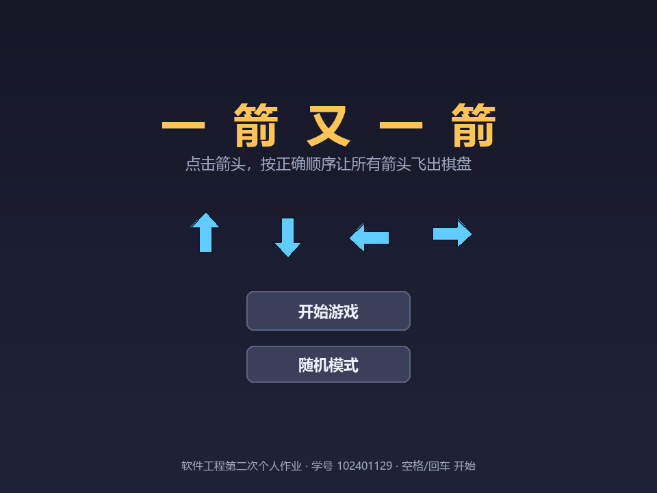
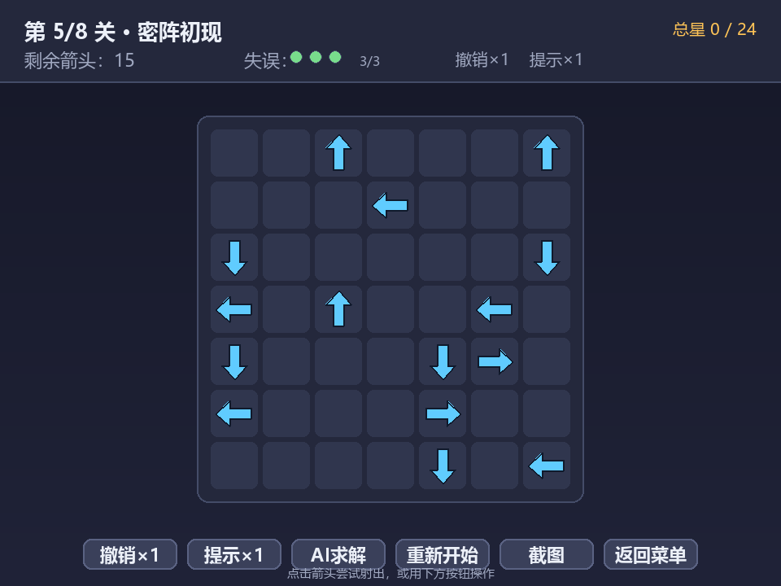
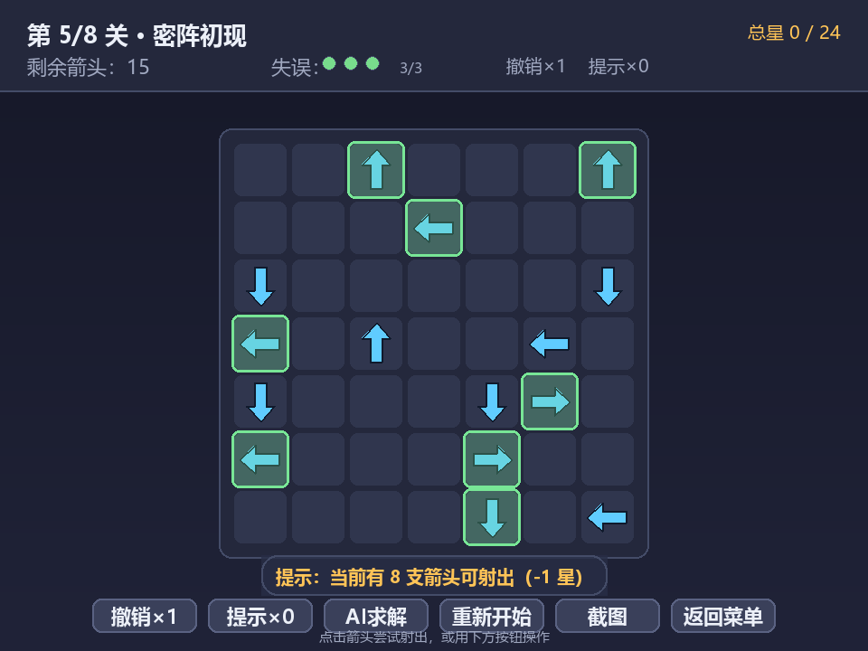
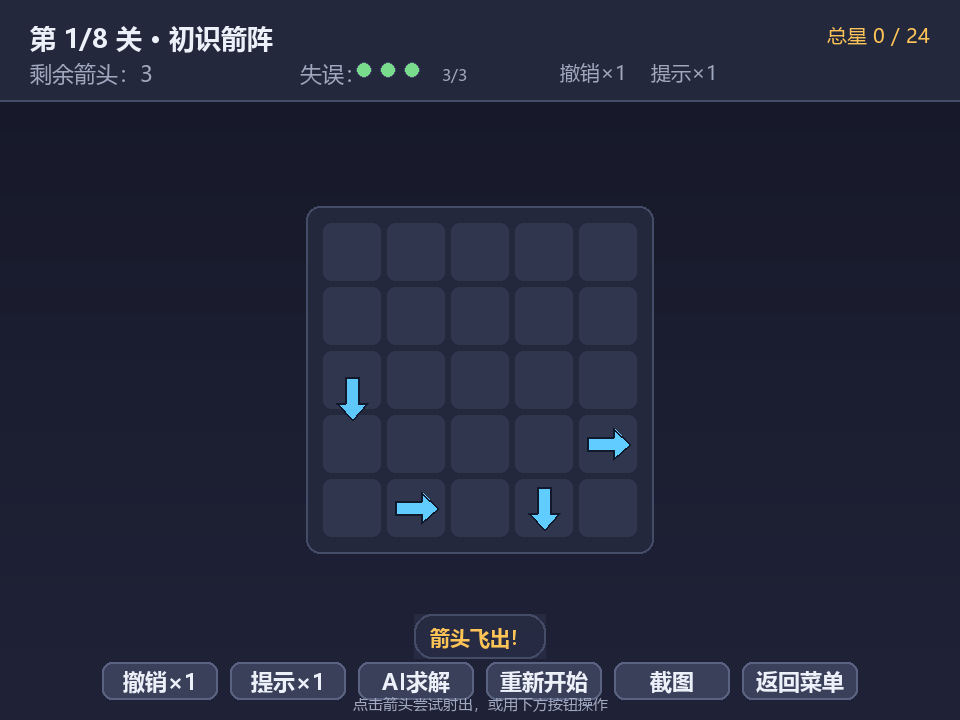
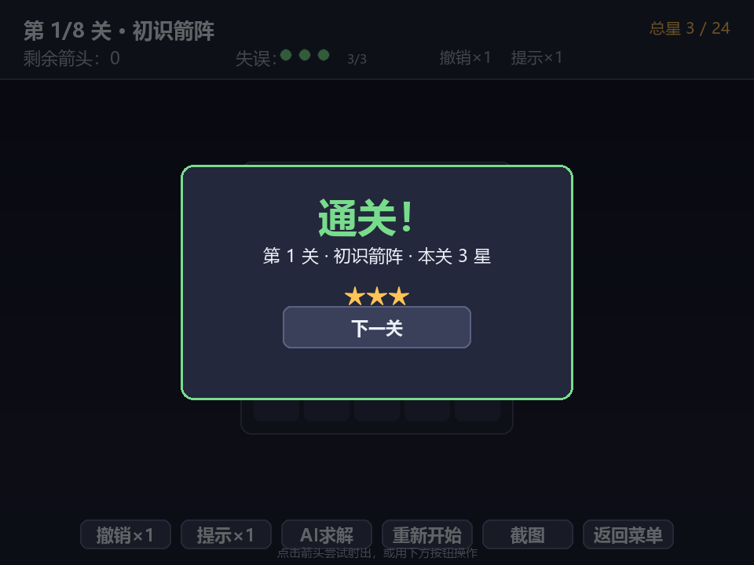
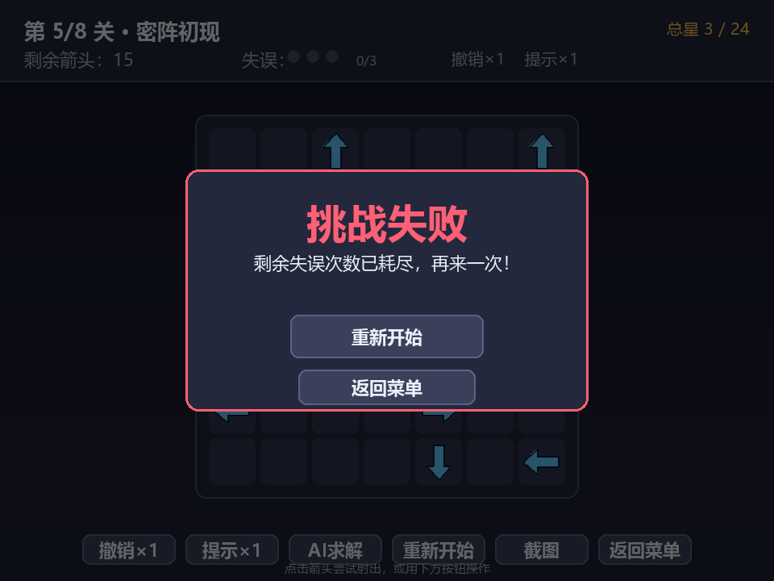
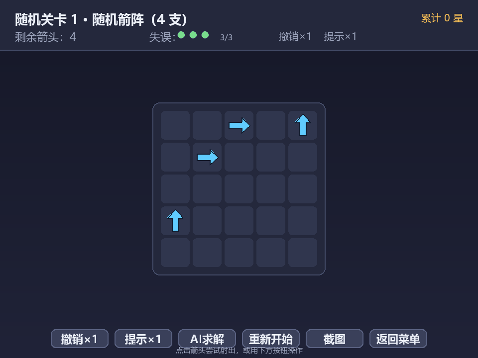

# 一箭又一箭

> 软件工程课程第二次个人作业 · 学号 102401129
> 使用 Python + Pygame 开发的点击式箭头解谜小游戏，借助 AIGC 工具辅助完成。

## 项目简介

> 🎮 **在线试玩（网页版）**：https://lin634.github.io/lsh.github.io/game/ （Pygbag 将本游戏编译为浏览器可运行版本）

“一箭又一箭”是一类点击式箭头解谜游戏。棋盘上分布着朝 **上 / 下 / 左 / 右** 四个方向的箭头，玩家需要观察箭头的方向与相互阻挡关系，按合适顺序依次点击箭头，让所有箭头飞出棋盘。

核心规则：

- 点击一支箭头时，程序检查它**前进方向上（同一行或同一列、直到棋盘边界）**是否还有其他箭头；
- **无阻挡** —— 箭头飞出棋盘并消失；
- **有阻挡** —— 箭头不能消失，发生碰撞反馈（晃动 + 变红），并消耗 1 次失误机会；
- 清空本关全部箭头即**通关**；最后一支箭头会先完整飞出棋盘（飞出动画播完），再弹出通关画面、进入下一关；
- 失误次数耗尽则**失败**，可重新开始本关；
- 每关失误上限**统一为 3 次**，每关最高 **3 星**，按是否借助辅助功能评星（见下节）。

## 失误与星级规则

每一关的失误上限统一为 **3 次**。失误只决定「能否通关」，不参与扣分；星数由是否借助辅助功能决定：

| 情形 | 本关星数 |
| --- | --- |
| 不使用任何辅助（撤销 / 提示 / AI） | 3 星 |
| 使用过 1 次撤销，或 1 次提示 | 2 星 |
| 撤销与提示都用过 | 1 星 |
| 使用过 AI 自动求解 | 1 星（无论是否同时用过撤销 / 提示） |

- **撤销、提示各只有 1 次机会**，用一次本关即封顶 2 星；第二次点击时机会数已为 0，程序会提示「机会已用完」且不做任何改动；
- 失误本身**不扣星**——鼓励玩家尝试，把「失误」留作过关门槛而不是评分项；
- 固定关卡共 8 关，满分 **24 星**。顶部状态栏实时显示累计星数，通关界面显示本关所得，全部通关界面显示总星数；
- 中途重新开始本关会**退回本关已计入的星数**，避免重复计分。

## 开发环境

| 项 | 说明 |
| --- | --- |
| 操作系统 | Windows 10/11 |
| Python | 3.10（≥ 3.8 均可） |
| 图形库 | Pygame 2.6.1 |
| 开发工具 | AIGC 编程助手（Claude / ZCode）+ Git |
| 字体 | 系统自带 Microsoft YaHei（`msyh.ttc`），无需额外素材 |

本项目**不依赖任何外部图片、音效或字体素材**，所有箭头与界面均由 Pygame 绘制，方便直接运行。

## 目录结构

```
第二次作业/
├── arrow_game.py         # 游戏主程序（界面 + 逻辑 + 动画）
├── verify_levels.py      # 关卡可解性验证工具（DFS 求解器，开发期使用）
├── test_game.py          # 自动化逻辑测试 T01–T09（headless，无需显示器）
├── make_screenshots.py   # 自动生成界面截图（headless）
├── requirements.txt      # 依赖列表
├── README.md             # 本文件
├── 软件工程第二次个人作业.md  # 博客园博文
└── screenshots/          # 游戏截图
    ├── 01_menu.png
    ├── 02_play_level1.png
    ├── 03_hint.png
    ├── 04_arrow_flyout.png
    ├── 05_level_clear.png
    ├── 06_game_over.png
    ├── 07_victory.png
    ├── 08_random_mode.png
    └── 09_clear_2stars.png
```

## 安装与运行

```bash
# 1. 安装依赖
pip install -r requirements.txt

# 2. 运行游戏
python arrow_game.py
```

> 若在无显示器的服务器上想快速验证逻辑，可运行自动化测试：
> ```bash
> python test_game.py          # 8 项逻辑测试（含随机模式与 AI 求解）
> python verify_levels.py      # 验证 8 个关卡均可通关
> ```

## 游戏操作说明

> 游戏界面底部提供**按钮栏**：撤销 / 提示 / AI求解 / 重新开始 / 截图 / 返回菜单——**纯鼠标即可完成全部操作**，键盘快捷键同样保留。

| 操作 | 作用 |
| --- | --- |
| 鼠标左键 | 点击箭头，尝试让其飞出棋盘 |
| 底部按钮栏 | 撤销、提示、AI求解、重新开始、截图、返回菜单 |
| `R` | 重新开始当前关卡（快捷键） |
| `Z` | 撤销上一步（快捷键） |
| `H` | 提示当前可飞出的箭头（快捷键） |
| `S` | AI 自动求解当前关卡（快捷键） |
| `空格` / `回车` | 开始 / 下一关 / 失败后重试（快捷键） |
| `ESC` | 返回菜单 / 再按退出（快捷键） |
| `F2` | 保存当前画面截图（快捷键） |

界面元素：顶部状态栏显示 **当前关卡、剩余箭头数、剩余失误次数（圆点）**；底部按钮栏提供全部操作按钮。

## 游戏截图

### 开始界面


### 游戏界面（第 5 关 · 密阵初现，15 支箭）


### 提示功能（高亮可飞出箭头）


### 箭头飞出动画


### 通关界面


### 失败界面


### 全部通关


### 随机模式（箭头随机分布，难度递增）


## 关卡说明

| 关卡 | 名称 | 规模 | 失误上限 | 设计要点 |
| --- | --- | --- | --- | --- |
| 1 | 初识箭阵 | 5×5 / 4 箭 | 3 | 热身，含一处依赖 |
| 2 | 小试锋芒 | 6×6 / 8 箭 | 4 | 多方向散布，逐步熟悉 |
| 3 | 渐入佳境 | 6×6 / 10 箭 | 4 | 箭头增多，二维交叉 |
| 4 | 左右逢源 | 7×7 / 12 箭 | 5 | 更大棋盘，四处牵制 |
| 5 | 密阵初现 | 7×7 / 15 箭 | 6 | 双列/双行分头突破 |
| 6 | 迷雾重重 | 8×8 / 18 箭 | 7 | 8×8 棋盘，左右呼应 |
| 7 | 箭雨滂沱 | 8×8 / 22 箭 | 8 | 22 支箭，依赖渐深 |
| 8 | 万箭归宗 | 8×8 / 25 箭 | 9 | 25 支箭，最密集，需整体规划 |

每个关卡都由 `generate_random_level` 以固定种子生成：箭头尽量随机分布（杜绝整行同向、连续同向过长、箭头扎堆），并都经过 `verify_levels.py` 的 DFS 求解器验证可通关。

## 主要功能与特色

- **完整游戏流程**：开始界面 → 游戏界面 → 通关 / 失败界面 → 全部通关；
- **正确的四方向路径检测**：同一行 / 列、到边界的阻挡判断，边界朝外不越界；
- **飞出 + 碰撞动画**：飞出箭头带渐隐位移动画，碰撞箭头带晃动与红色高亮；
- **失误机制**：圆点直观显示剩余次数，耗尽即失败；
- **8 个可通关关卡**（4~25 支箭），难度递增；
- **随机模式**：主菜单可选无尽模式，每关箭头随机分布、难度逐关递增，生成器在构造上保证可通关；
- **AI 自动求解**（`S`）：用依赖图拓扑排序算出合法消除顺序，自动逐步演示通关；中途局面也能求解；
- **附加功能**：撤销上一步（`Z`）、提示（`H`）、星级评价（按失误数给 1–3 星）、一键截图（`F2`）；
- **零素材依赖**，跨机器可直接运行。

## 测试

`test_game.py` 包含 8 项自动化逻辑测试，覆盖作业要求的全部测试点（T01–T06）并附加随机模式（T07）与 AI 求解（T08），运行 `python test_game.py` 即可复现。

## AIGC 使用说明

本项目在 AIGC 编程助手的辅助下完成，主要协作过程包括：路径检测代码生成与 Bug 修复、关卡设计与可解性验证、碰撞动画与界面实现、字体兼容性问题修复等。详细记录见博客园博文 `软件工程第二次个人作业.md` 中「AIGC 使用过程」一节。
