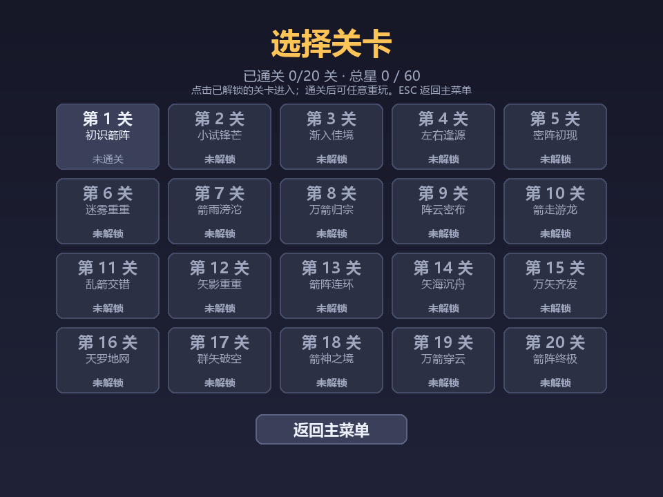
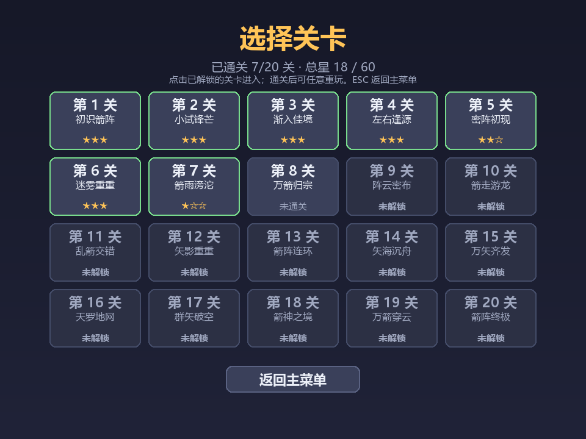
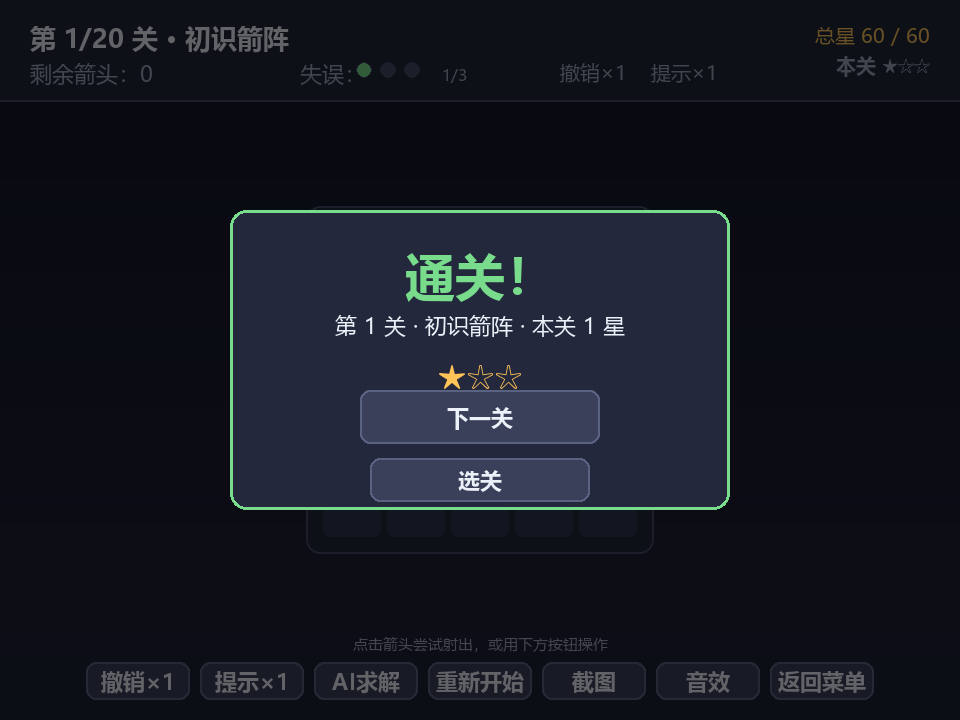

# 202601 软件工程课程第二次个人作业 ——「一箭又一箭」小游戏

| 这个作业属于哪个课程 | [202601 软件工程](https://edu.cnblogs.com/campus/fzu/202601SofwareEngineering) |
| :---: | :---: |
| 这个作业要求在哪里 | [第二次个人作业要求](https://edu.cnblogs.com/campus/fzu/202601SofwareEngineering/homework) |
| 这个作业的目标 | 使用 Python 和 AIGC 完成「一箭又一箭」小游戏 |
| 学号 | 102401129 |
| GitHub 仓库 | [lin634/software-engineering](https://github.com/lin634/software-engineering) |

> 项目内容：使用 Python + Pygame 开发点击式箭头解谜小游戏「一箭又一箭」，并在 AIGC 编程助手辅助下完成需求分析、代码编写、关卡设计与测试。

---

## 一、项目展示

游戏包含 **开始界面、关卡选择界面（二级菜单）、游戏界面、通关 / 失败界面、全部通关界面**，箭头飞出与碰撞均有动画反馈。

### 1. 开始界面


进入程序后显示标题、当前进度（已通关关数与总星数）与「开始游戏」按钮，点击按钮或按空格进入关卡选择界面。

### 1.1 关卡选择界面（附加）



点「开始游戏」进入二级菜单，20 个关卡以 5×4 网格排列，每格显示关卡号、名称与状态：

- **解锁规则**：第 1 关默认开放，通关第 N 关解锁第 N+1 关；锁定的关卡置灰显示「未解锁」，点击会提示「尚未解锁」而不进入；
- **可重玩**：已通关的关卡始终可选，界面直接显示该关的 **历史最佳星级**（★★★ / ★★☆ …）；
- **进度展示**：顶部显示「已通关 X / 20 关 · 总星 Y / 60」；
- **进度保留**：进度只保存在内存里（`cleared` 集合 + `level_stars` 字典），程序运行期间随时从通关 / 失败界面返回都能接着玩；**退出程序即重置**，无需任何存档与读取逻辑。



通关 7 关后的选关界面：每格显示历史最佳星级，第 8 关已解锁、第 9 关及以后仍未解锁。

### 2. 游戏界面


顶部状态栏显示当前关卡、剩余箭头数、剩余失误次数（以圆点表示）、撤销 / 提示剩余次数、累计星数与本关实时星数（★/☆）；底部按钮栏提供撤销 / 提示 / AI求解 / 重新开始 / 截图 / 音效 / 返回菜单，纯鼠标即可完成全部操作。

### 3. 提示功能（附加）


按 `H` 可高亮当前所有可飞出的箭头，帮助新手判断局面。

### 4. 箭头飞出动画


点击前方无阻挡的箭头时，箭头沿其方向飞出棋盘，并带渐隐动画。

### 5. 通关界面


清空本关全部箭头后，最后一支箭头会先完整飞出棋盘（飞出动画播完），再弹出通关面板，按本关失误与辅助使用情况给出 0–3 星评价，点击「下一关」直接进入下一关，或点「选关」返回二级菜单自由选关。

### 6. 失败界面


失误次数耗尽时弹出失败面板，可选择「重新开始」或「返回选关」。

### 7. 全部通关


通过第 20 关后显示「全部通关」，并给出总星数（满分 60 星）。

### 8. 随机模式（附加）


主菜单可选「随机模式」：每关箭头随机分布、难度逐关递增，生成器在构造上保证可通关。

### 9. AI 自动求解（附加）

游戏中按 `S`，AI 用拓扑排序算出合法消除顺序并自动逐步演示通关；下到一半卡住时也能求解剩余部分，再按 `S` 或任意操作可停止。

### 10. 星级示例：撤销扣 1 星 → 本关 2 星（附加）


### 11. 星级示例：失误 2 次扣 2 星 → 本关 1 星（附加）



每次失误、撤销、提示各扣 1 星，右上角色块实时反映本关剩余星数。

### 12. 运行时合成音效（附加）

全部音效由 NumPy 在运行时合成波形生成，项目不携带任何音频文件：

```python
def _tone(freq_start, freq_end=None, dur=0.2, wave="sine", volume=0.5,
          attack=0.004, noise=0.0):
    t = np.arange(n) / AUDIO_RATE
    phase = 2 * np.pi * (f0 * t + (f1 - f0) * t * t / (2 * dur))   # 线性扫频
    w = np.sin(phase)                       # sine / triangle / square / saw
    env = np.ones(n); env[:half] = np.linspace(0, 1, half)          # 淡入去爆音
    env[half:] *= np.linspace(1, 0.04, n - half)                    # 缓慢衰减收尾
    return (w * env * volume * 32000 / peak).round().astype(np.int16).tobytes()
```

共 8 个音效：射出（明亮上行拨弦）、阻挡（低频方波 + 白噪声闷响）、按钮点击、撤销、提示、通关琶音（C-E-G）、失败下行音阶、通关庆祝琶音。`SoundBank` 封装 `mixer.init(44100, -16, 1, 256)` 与 8 个 `Sound(buffer=...)`，任何一步失败都退化为静音而不抛异常；底部「音效」按钮或 `M` 键可整体开关。

---

## 二、项目介绍

### 游戏规则

棋盘中分布着朝 **上 / 下 / 左 / 右** 四个方向的箭头。玩家点击一支箭头时：

- 程序检查该箭头**前进方向上（同一行或同一列、直到棋盘边界）**是否还有其他箭头；
- **无阻挡** —— 箭头飞出棋盘并消失；
- **有阻挡** —— 箭头不能消失，发生碰撞反馈（晃动 + 变红），并消耗 1 次失误机会；
- 清空本关全部箭头即**通关**；最后一支箭头会先完整飞出棋盘（飞出动画播完），再弹出通关画面、进入下一关；
- 失误次数耗尽则**失败**，可重新开始本关；
- 每关失误上限统一为 **3 次**，满分 **3 星**：每失误、撤销、提示一次各扣 1 星，星数下限 0；使用 AI 自动求解固定只给 1 星；
- 共 **20 个固定关卡**，按顺序解锁：通关第 N 关解锁第 N+1 关，已通关关卡可任意重玩；通关进度只保存在内存中，**程序不关闭就保留，退出程序即重置**；
- 固定关卡**按关记录历史最佳星数**，总星数 = 各关最佳之和（满分 60 星），重玩同一关不会重复加分、也不会退星。

### 界面设计

- 顶部状态栏：当前关卡（X / 关卡总数）、剩余箭头数、剩余失误次数（圆点 + 数字）、撤销 / 提示剩余次数、累计星数与本关实时星数（★/☆）；
- 中央棋盘：按关卡尺寸自动居中的网格，每格内绘制方向箭头；
- 关卡选择界面：20 个关卡以 5×4 网格排列，每格显示关卡号、名称与状态（未解锁 / 历史星级 / 未通关），顶部显示整体进度；
- 底部按钮栏：**撤销 / 提示 / AI求解 / 重新开始 / 截图 / 音效 / 返回菜单**——全部功能做成按钮，纯鼠标即可操作（键盘快捷键同样保留）；
- 弹层：通关 / 失败 / 全部通关使用半透明遮罩 + 居中面板；操作反馈显示在按钮栏上方的半透明气泡里，不会压住可点击的按钮。

### 主要功能

- 完整游戏流程：开始 → 游戏 → 通关 / 失败 → 全部通关；
- 正确的四方向路径检测与边界处理；
- 飞出渐隐动画、碰撞晃动 + 变红反馈；
- 失误机制与圆点显示；
- 20 个难度递增（4~26 支箭，5×5 → 8×8）、均经过求解器验证的可通关关卡，失误上限统一为 3 次；
- 关卡选择二级菜单：按关顺序解锁、已通关可重玩、界面显示每关历史星级与整体进度（附加）；
- 通关进度内存保留：程序运行期间进度与解锁状态一直有效，退出程序自动重置，无需存档代码（附加）；
- 运行时合成音效：8 个音效全部由 NumPy 生成波形，无音频素材文件；
- 随机模式：每关箭头随机分布、难度逐关递增，可通关由构造保证（附加）；
- AI 自动求解：按 `S` 用拓扑排序算出合法消除顺序并自动演示通关，中途局面也能求解（附加）；
- 重新开始功能（按钮 / `R` 键）。

### 特色（附加功能）

- **随机模式**：`generate_random_level` 随机撒点并用「依赖无环 + 分布约束」保证可通关且布局尽量随机（无整行同向）；
- **AI 自动求解**（`S`）：用依赖图拓扑排序求合法消除顺序，自动逐步演示通关；
- **撤销上一步**（`Z`）：保存每一步快照，可回退成功或失败的点击；
- **提示功能**（`H`）：高亮当前所有可飞出的箭头；
- **星级评价**：满分 3 星，失误 / 撤销 / 提示各扣 1 星（下限 0 星），AI 求解固定 1 星，右上角实时显示本关星数；
- **运行时合成音效**：射出 / 阻挡 / 按钮 / 撤销 / 提示 / 通关 / 失败 / 庆祝共 8 个音效由 NumPy 合成波形生成，底部「音效」按钮或 `M` 键一键静音；
- **一键截图**（`F2`）：保存当前画面到 `screenshots/`；
- **零素材依赖**：箭头与界面全部由 Pygame 程序化绘制，音效全部运行时合成，跨机器可直接运行。

---

## 三、实现思路

### 1. 箭头、方向与关卡的表示

- **箭头**：用 `dataclass` 定义，包含方向 `d` 与两个动画计时器 `shake`（碰撞晃动剩余时间）、`flash`（碰撞变红剩余时间）：

```python
@dataclass
class Arrow:
    d: str                      # 方向 'U'/'D'/'L'/'R'
    shake: float = 0.0          # 剩余抖动时间（秒）
    flash: float = 0.0          # 碰撞红色高亮剩余时间（秒）
```

- **棋盘**：二维列表 `board[r][c]`，每个元素是 `Arrow` 或 `None`（空地）。
- **方向向量**：用 `(dr, dc)` 表示，`U=(-1,0)`（行减＝上）、`D=(1,0)`、`L=(0,-1)`、`R=(0,1)`。
- **关卡**：`LEVELS` 是一个列表，每个关卡用字符串数组描述，`.` 为空地，`U/D/L/R` 为对应方向的箭头，并附带关卡名称与失误上限（20 关统一为 3 次）：

```python
LEVELS = [
    {"name": "小试锋芒", "mistakes": 3,
     "grid": [".L..U.", "...R..", "DU....", "R.....", ".....R", ".D...."]},
    # ... 共 20 关，棋盘从 5×5 扩大到 8×8，箭头数从 4 支增加到 26 支
]
```

### 2. 路径检测（重点）

路径检测是本游戏的核心逻辑。题目要求：只需判断同一行或同一列、箭头与边界之间是否还有其他箭头。实现上从箭头位置出发，沿其方向向量逐格前进，遇到箭头即判定被阻挡，走到边界仍无箭头即判定畅通：

```python
def is_clear(self, r, c, d):
    """箭头 (r,c) 朝方向 d 到边界之间是否没有其他箭头阻挡。"""
    dr, dc = DIR_VEC[d]
    nr, nc = r + dr, c + dc
    while 0 <= nr < self.rows and 0 <= nc < self.cols:
        if self.board[nr][nc] is not None:
            return False            # 路径上有箭头 -> 阻挡
        nr += dr
        nc += dc
    return True                     # 走到边界仍无阻挡 -> 畅通
```

关键点：

- **逐格前进而非整段扫描**：逻辑清晰，便于扩展（如未来加入机关格）；
- **边界安全**：`while` 的条件 `0 <= nr < rows and 0 <= nc < cols` 保证朝向棋盘外的边缘箭头（例如第 0 行朝上的箭头）第一次循环就因越界退出，直接返回 `True`，**不会发生数组越界**；
- **方向正确性**：四个方向共享同一段代码，只需 `DIR_VEC` 映射正确，避免为每个方向写重复分支（开发初期曾因 `R` 方向向量写错为 `(1,0)` 导致右箭头按「向下」判断，见 AIGC 记录第 1 条）。

### 3. 点击处理与状态流转

点击箭头后，根据 `is_clear` 结果分流：

- 畅通：把箭头转为 `Projectile`（飞出动画对象）并从棋盘移除；若 `arrows_left()==0` 则进入 `LEVEL_CLEAR`；
- 阻挡：触发 `shake` / `flash`，`mistakes -= 1`；若 `mistakes==0` 则进入 `GAME_OVER`。

游戏状态机：`MENU → LEVEL_SELECT → PLAYING → LEVEL_CLEAR → PLAYING(下一关) … → VICTORY`，其中 `LEVEL_SELECT` 是关卡选择二级菜单：`PLAYING` / `LEVEL_CLEAR` / `GAME_OVER` 都可通过返回按钮或 `ESC` 回到 `LEVEL_SELECT`，在 `LEVEL_SELECT` 中再按 `ESC` 回主菜单；任意 `PLAYING` 状态可 `重新开始 → PLAYING`，失败可 `重试 → PLAYING`。

### 4. 动画

- **飞出**：`Projectile` 以 900 px/s 沿方向移动，并在 `life` 内通过 `set_alpha` 渐隐；
- **碰撞**：箭头 `shake` 计时器期间，绘制时横向叠加 `sin(t)*amp` 偏移产生晃动，`flash` 期间颜色在青色与红色间线性插值。

### 5. 关卡可解性验证

为避免「设计出无法通关的关卡」，另写了 `verify_levels.py`，用 DFS 搜索所有可能的射出顺序，若能把棋盘清空则可通关，并输出一条通关顺序。本作业 20 个关卡（4~26 支箭）均通过验证。

### 6. 随机关卡生成（附加功能）

为了让箭头分布“尽量随机”，`generate_random_level` 采用「随机撒点 + 可通关判定 + 分布约束」：

1. 在棋盘上随机选格、随机选方向放置箭头；选方向时避开与已有箭头“同线相对”的必死组合（如本行右侧已有 `←` 就不选 `→`）；
2. 用**依赖图无环**判定可通关——箭头 X 位于 Y 的前进射线上则 X 必须先消除，图中无环 ⇔ 存在合法消除顺序（与 DFS 求解器等价但更快）；
3. **分布约束**保证布局随机自然：杜绝整行 / 整列同向（≥3 支）、连续同向过长（>2 支）、以及单行 / 单列箭头过度扎堆；不满足则换随机种子重试。

生成结果用 `verify_levels.solve` 批量验证：随机 300 关全部可通关、无整行同向。**20 个固定关卡也全部由同一生成器以固定种子生成**（生成脚本 `gen_new_levels.py`），因此既保留“设计关卡”的要求，布局又随机自然。

### 7. AI 自动求解（附加功能）

按 `S` 触发 AI 自动求解。算法基于依赖图的**拓扑排序**：

- 对每支箭 Y，凡位于 Y 前进射线上的箭头 X 都必须先于 Y 消除，记为依赖边 X→Y；
- 该依赖图无环 ⇔ 可通关（与第 5 节的 DFS 判定等价）；
- 用 Kahn 算法做拓扑排序，得到的任一顺序就是合法消除序——按此顺序点击，每支箭面对的都是空路；
- 求解在**当前局面**上计算，所以玩家下到一半卡住时按 `S` 也能求解剩余部分；自动以约 0.32 秒/步演示，再按 `S` 或任意手动操作可停止。

```python
def _solve_order(self):
    arrows = {(r, c): self.board[r][c].d for ...}
    adj, indeg = ..., ...
    for (r, c), d in arrows.items():        # 建依赖边 X->Y
        nr, nc = r+dr, c+dc
        while 0 <= nr < rows and 0 <= nc < cols:
            if (nr, nc) in arrows:
                adj[(nr, nc)].append((r, c)); indeg[(r, c)] += 1
            nr += dr; nc += dc
    q = deque(sorted(p for p in arrows if indeg[p] == 0))   # Kahn 拓扑排序
    order = []
    while q:
        p = q.popleft(); order.append(p)
        ...  # 邻居入度 -1，归零入队
    return order if len(order) == len(arrows) else []        # 不等长则有环
```

### 8. 星级计分（附加功能）

每关满分 3 星，按本关已用资源扣分，用一个函数即时计算，HUD 与通关面板都调用它：

```python
def calc_stars(self):
    if self.used_ai:                       # 用 AI 求解固定只给 1 星
        return 1
    misses = self.mistakes_max - self.mistakes      # 已失误次数，每次扣 1 星
    return max(0, 3 - misses - int(self.used_undos) - int(self.used_hints))
```

设计要点：

- 失误、撤销、提示**各扣 1 星**，星数下限 0；因为 3 次失误直接 `GAME_OVER`、无法通关，所以「能通关的最坏情况」是 2 次失误 + 撤销 + 提示 = 扣 4 项，`max(0, …)` 取整后为 0 星，绝不会变负；
- 撤销、提示各只有 1 次机会（`undos_left` / `hints_left`），用一次就清零，第二次点击被拒绝；
- AI 自动求解优先级最高，固定 1 星，不再与上面的扣分叠加；
- 顶部状态栏用「本关 ★★☆」实时显示，通关面板用 `calc_stars()` 结果定格；重开本关会先 `total_stars -= self.stars` 退回已计入的星数，避免重复计分。

### 9. 关卡选择二级菜单与通关进度（附加功能）

主菜单点「开始游戏」不再直接进第一关，而是进入 `LEVEL_SELECT` 二级菜单。设计要点：

- **解锁规则**：`is_unlocked(i)` 只在 `i == 0`、上一关已通关或本关已通关时返回真，因此关卡严格按顺序推进；点击未解锁的格子只弹提示气泡，不会加载关卡。
- **进度只存内存**：两个实例变量就够——`cleared`（已通关关卡号的集合）和 `level_stars`（每关历史最佳星数）。通关时 `cleared.add(i)` 并 `level_stars[i] = max(旧值, 本关星数)`；`total_stars` 不再自己累加，而是随时由 `sum(level_stars.values())` 重新算出。**程序运行期间进度一直有效，退出进程即随对象一起销毁，天然满足「关闭即重置」，完全不需要读写存档文件。**
- **重玩不退星、不重复加分**：因为总星数取的是「各关最佳之和」而不是累加，已通关关卡反复重玩都只保留最好成绩；随机模式没有关卡号，仍保留原来的本局累加逻辑，重开时退回本关已计入的星数。
- **界面**：20 格按 5×4 网格排布，锁定格子置灰显示「未解锁」，已通关格子显示历史星级，顶部显示「已通关 X / 20 关 · 总星 Y / 60」，主菜单也同步显示进度。
- **流线上**：通关面板的返回按钮改为「选关」、失败面板改为「返回选关」，都在关卡内也能随时回到二级菜单挑关，不用一路退回主菜单。

### 10. 运行时合成音效（附加功能）

全部音效由 NumPy 合成波形，不依赖任何音频素材：

- `_tone(freq_start, freq_end, dur, wave, volume, attack, noise)`：在 `freq_start → freq_end` 之间做线性扫频，支持 `sine / triangle / square / saw` 四种波形，`noise>0` 时混入白噪声（做碰撞闷响质感），前半段 `linspace(0,1)` 淡入去爆音、后半段指数式衰减收尾，最后归一化峰值并转 `int16` PCM；
- `_seq(notes, gap)`：把多段 `_tone` 用静音间隔拼成琶音 / 音阶（通关、失败、庆祝）；
- `SoundBank` 在 `pygame.mixer.init(44100, -16, 1, 256)` 后用 `pygame.mixer.Sound(buffer=...)` 包装 8 个音效；`mixer.init` 失败、`numpy` 缺失或 `Sound(buffer=...)` 抛异常时统一退化为 `available=False` 静音，不影响游戏；
- 触发点：射出 `shoot`、阻挡 `hit`、按钮 `click`、撤销 `undo`、提示 `hint`、通关 `clear`、失败 `over`、全部通关 `victory`；
- 开关：底部「音效」按钮或 `M` 键调用 `toggle_sound()`，内部用 `pygame.mixer.set_num_channels(0|8)` 物理静音，按钮文字与颜色同步显示「音效：开 / 关」。

---

## 四、AIGC 使用过程

开发过程中使用 AIGC 编程助手（Claude / ZCode Agent）辅助。以下为具有代表性的 8 次协作记录。

| 子任务 | 借助何种 AIGC 技术 | AI 实现或提供了什么 | 效果如何 | 人工修改 |
| ---- | ---- | ---- | ---- | ---- |
| 路径检测 | Claude / ZCode Agent | 生成四方向统一的 `is_clear` 检测代码与方向向量 `DIR_VEC` | 首版把 `R` 方向误写为 `(1,0)`（即“向下”），导致右箭头按列判断、T01/T02/T05/T06 测试失败 | 依测试结果定位并修正 `DIR_VEC["R"]` 为 `(0,1)`，全部测试通过 |
| 关卡设计 | Claude / ZCode Agent | 生成 8 个候选关卡网格（4~25 支箭，二维布局） | 初版存在同列 `↓`/`↑` 相对互挡的死局，且出现整行同向、分布不随机 | 编写 `verify_levels.py` DFS 求解器逐关验证；改用随机生成器以固定种子重建 8 关，最终全部验证可通关 |
| 碰撞动画与界面 | Claude / ZCode Agent | 生成晃动 + 变红碰撞反馈、飞出渐隐动画、状态机与 HUD | 基本可用，箭头与按钮布局合理 | 调整晃动时长 0.5s、飞出时长 0.8s 与配色，增加星级评价与提示高亮 |
| 字体渲染兼容 | Claude / ZCode Agent | 提供基于 `pygame.font.SysFont` 的字体加载 | 本机 `SysFont` 枚举系统字体时崩溃（`initsysfonts_win32` 报 `TypeError: ... not int`） | 改用 `pygame.font.Font` 直接打开 `msyh.ttc` 加载中文字体，绕过系统枚举，截图与实机均正常 |
| 随机关卡生成 | Claude / ZCode Agent | 设计「随机撒点 + 依赖无环 + 分布约束」的随机生成算法 | 纯随机撒点易出同列 `↓`/`↑` 死局或整行同向；加入约束后 300 关批量验证全部可通关、无整行同向 | 实现依赖图无环判定替代全量 DFS 提速；设定箭头密度上限（≤42% 格子）、换种子重试；新增 T07 随机可通关测试用例 |
| 星级计分规则 | Claude / ZCode Agent | 设计「满分 3 星，失误 / 撤销 / 提示各扣 1 星，AI 固定 1 星」的计分函数 | 初版失误不扣星、撤销提示各封顶，规则分散在多个分支，易漏算 | 统一收敛到 `calc_stars()` 单函数计算，`max(0, …)` 保证下限 0，HUD 实时显示「本关 ★★☆」，通关面板复用同一函数；新增 T09 测试用例固化 |
| 运行时合成音效 | Claude / ZCode Agent | 设计 `_tone` / `_seq` / `SoundBank`：NumPy 合成波形（扫频 + 包络 + 白噪声）并 `mixer.Sound(buffer=...)` 播放 | 直接 `mixer.init` 覆盖了 `pygame.init()` 的默认参数，偶发初始化冲突；Web 端无音频设备时可能崩溃 | 每次先 `mixer.quit()` 再以统一参数初始化；`numpy` 缺失 / 初始化失败 / 播放异常全部 try 捕获退化为静音；新增底部「音效」按钮与 `M` 键开关 |

### 第 1 次：路径检测代码生成与方向 Bug 修复

我向 AI 提出需求：“实现箭头点击后的路径检测，只需判断同一行或同一列、箭头与边界之间是否还有其他箭头，四个方向统一处理。”AI 给出了一段基于方向向量 `(dr, dc)` 逐格前进的 `is_clear` 方法，逻辑简洁。但我随即编写自动化测试 `test_game.py` 后发现 T01、T02、T05、T06 多项失败。定位后发现 AI 生成的方向字典里 `R` 被写成了 `(1, 0)`（实际是“向下”），右箭头于是按列判断。我把 `DIR_VEC["R"]` 改回 `(0, 1)` 后全部测试通过。这次让我切身体会到 **AI 生成代码必须用测试把关**。

### 第 2 次：关卡设计与可解性验证

我让 AI 生成 8 个难度递增、箭头更多且分布在多行多列的关卡。AI 的初稿存在两类问题：一是箭头太少、多为单行布置，不够刺激；二是部分候选在同列放了一支 `↓` 和一支 `↑`，二者相对互挡，属于无法通关的死局。我没有直接采用，而是让 AI 额外写了一个 DFS 求解器 `verify_levels.py`：对每关搜索所有可能的射出顺序，能清空则可通关，并打印通关顺序。据此我逐关验证并调整——剔除死局、把棋盘扩到 8×8、把箭头数从 3 支逐步加到 24 支、用“横链 + 同向纵链 + 垂直门控”的组合布置二维依赖，最终 8 关全部验证可通关。**关卡设计必须保证可解，不能只凭感觉；难度要靠箭头密度与依赖深度来体现。**

### 第 3 次：碰撞动画与界面实现

在路径逻辑稳定后，我请 AI 补全“碰撞反馈”和“飞出动画”。AI 给出了：碰撞时给箭头设置 `shake` / `flash` 计时器，绘制时叠加正弦偏移与颜色插值；飞出时生成 `Projectile` 沿方向位移并 `set_alpha` 渐隐。整体可用，我随后微调了动画时长、圆点式失误显示与通关星级评价，使反馈更明显、界面更清爽。

### 第 4 次：字体兼容性问题

实机与离屏截图时，`pygame.font.SysFont` 在本机枚举系统字体阶段崩溃（`initsysfonts_win32` 内 `os.path.splitext` 收到非字符串值）。我让 AI 改为直接用 `pygame.font.Font` 打开 `C:\Windows\Fonts\msyh.ttc` 加载中文字体，并设好回退顺序，绕过了系统字体枚举的 Bug，中文显示正常、跨机器也可运行。

### 第 5 次：随机关卡生成器

我想让箭头分布更有随机性。最初让 AI 在棋盘上随机撒箭头，结果很快出现两类问题：同列 `↓` 与 `↑` 相对互挡的死局，以及整行全是同一方向的“很假”的布局。AI 随后给出“随机撒点 + 判定 + 约束”的完整方案：选方向时避开相对死局；用**依赖图无环**快速判定可通关（X 位于 Y 前进射线上则 X 必须先消除，无环 ⇔ 可通关）；再加分布约束杜绝整行/整列同向、连续同向过长与箭头扎堆，不满足就换种子重试。我据此落地 `generate_random_level`，并用 `verify_levels.solve` 批量验证 **300 关全部可通关、无整行同向**，新增 T07 测试用例固化保证。固定 8 关也改用同一生成器以固定种子重建，保证布局随机自然且每关可通关。

### 第 6 次：星级计分规则调整

作业中期要求把“失误不扣星、撤销 / 提示各封顶 2 星”调整为“**失误一次也扣一颗星**”。AI 先给出的是分散在 `click_cell`、`undo`、`use_hint` 各处的减法逻辑，容易漏算。我让它把规则收敛成一个纯函数 `calc_stars()`：`used_ai` 直接返回 1 星；否则 `3 - 已失误次数 - 撤销标记 - 提示标记` 再 `max(0, …)` 取底。因为 3 次失误已经 `GAME_OVER`，能通关的最坏情况是 2 次失误 + 撤销 + 提示 = 扣 4 项，取底后为 0 星、绝不会负。HUD 右上角新增「本关 ★★☆」实时显示，通关面板与截图脚本复用同一函数，保证“所见即所得”。同步更新了 T09 测试用例（1 次失误 → 2 星、2 次失误 → 1 星、2 次失误 + 撤销 → 0 星下限），全部通过。

### 第 7 次：运行时合成音效

我想给游戏加音效又不引入任何音频素材。AI 给出 NumPy 合成方案：`_tone()` 用 `np.arange` 生成时间轴，在起止频率间线性扫频（`phase = 2π(f0·t + (f1−f0)t²/2dur)`），支持正弦 / 三角 / 方波 / 锯齿四种波形，起始 `linspace(0,1)` 淡入去爆音、后半段线性衰减收尾，最后按峰值归一化转 `int16` PCM；`_seq()` 把多段音色拼成琶音 / 音阶；`SoundBank` 用 `mixer.Sound(buffer=...)` 包装 8 个音效。我随后处理了两个兼容性问题：一是直接 `mixer.init` 会覆盖 `pygame.init()` 的默认参数，改为先 `mixer.quit()` 再统一 `init(44100, -16, 1, 256)`；二是网页版（Pygbag）在无声卡环境会抛异常，把 `numpy` 缺失、初始化失败、播放异常全部 try 捕获退化为静音。底部按钮栏新增「音效」开关（`M` 键），`set_num_channels(0|8)` 物理静音，按钮文字随状态切换。

### 第 8 次：20 关难度阶梯、选关二级菜单与进度保留

后期我想把游戏从 8 关扩成 20 关、加一个选关二级菜单，并且「通关进度只要程序不关就保留、关掉就重置」。这一轮里 AI 帮了两件事，各踩过一个坑：

**关卡数据**：后 12 关由 `generate_random_level` 以固定种子生成（生成脚本 `gen_new_levels.py`），因为界面布局是按 8×8 最大棋盘算的，9×9 会溢出，所以难度只能靠**箭头数量与依赖深度**继续加深（24 → 26 支箭），AI 一开始给了 9×9 的规格，跑截图时发现网格直接压进负坐标才定位到布局常量。生成出来的每一关仍要过 `verify_levels.py` 的 DFS 验证；而前 8 关的网格保持字节级不变，是为了让既有的 T08/T09 用例（它们按具体格子坐标点击）不需要跟着改。

**进度模型**：第一版 AI 让 `total_stars` 在通关时直接累加，结果重玩同一关就会重复加分，而且中途按 `R` 重开本关后星数对不上。我把它改成「**按关记最佳**」：`level_stars` 存每关历史最佳，`total_stars` 每次由 `sum(level_stars.values())` 重新算出，随机模式因为没有关卡号才保留原来的累加逻辑、重开时退回本关已计入的星数。`cleared` 集合同时承担「解锁判定」和「可重玩判定」两件事。

**回归坑**：加了进度后 T09 突然失败（`c1`、`c8` 两项为假）。原因是 T08 通关第 3 关时往 `level_stars` 里写了记录，而 T09 的 `fresh()` 只把 `total_stars` 清零、没清 `level_stars`，于是重新求和时星数被推高。在 `setup()` 和 `fresh()` 两处都补上 `cleared` / `level_stars` / `total_stars` 的重置后才恢复全绿——**给被测代码加跨用例状态，必须同时隔离测试夹具里的状态**。我另外写了 T10 专门覆盖这一轮改动：解锁规则、未解锁关卡被拒绝、通关解锁下一关、进度在选关界面保留、已通关可重玩且不重复计分、20 关全清进入 `VICTORY`。

**「关闭即重置」的实现**：最终一行持久化代码都没有——进度只存在 `Game` 实例的两个变量里，退出进程自然消失。这提醒我：需求里写的「重置」不一定要翻译成「写文件再删文件」，先想清楚状态该活多久。

---

## 五、测试结果

采用自动化测试（`test_game.py`，headless 运行，不依赖显示器）逐项验证，覆盖作业要求的全部测试点：

| 编号 | 测试内容 | 预期结果 | 实际结果 | 是否通过 |
| ---- | ---- | ---- | ---- | ---- |
| T01 | 点击前方无阻挡的箭头 | 箭头飞出棋盘并消失，状态仍为游戏中 | 箭头移除、生成飞出弹丸、状态保持 PLAYING | ✓ 通过 |
| T02 | 点击前方有阻挡的箭头 | 箭头不消失，失误次数减 1，触发晃动 / 变红 | 箭头保留、失误 3→2、`shake`/`flash`>0 | ✓ 通过 |
| T03 | 点击位于边缘且朝向棋盘外的箭头 | 箭头正常消失，不发生越界错误 | 左/上/下三处边缘朝外箭头均正常移除，无异常 | ✓ 通过 |
| T04 | 消除本关全部箭头 | 显示通关并进入下一关 | 清空后进入 `LEVEL_CLEAR`，推进后加载下一关 | ✓ 通过 |
| T05 | 失误次数耗尽 | 显示失败并允许重新开始 | 失误归零进入 `GAME_OVER`，重试后恢复满失误 | ✓ 通过 |
| T06 | 游戏进行中重新开始 | 箭头布局和失误次数恢复 | 重新加载后布局与初始一致、失误恢复上限 | ✓ 通过 |
| T07（附加） | 随机模式：随机生成关卡 | 生成的关卡均可通关、无整行同向 | 批量生成 300 关，DFS 求解全部可通关 | ✓ 通过 |
| T08（附加） | AI 自动求解当前关卡 | 拓扑序可清空全部箭头 | 求解序长度等于箭头数，按序点击后清空并通关 | ✓ 通过 |
| T09（附加） | 星级规则：失误 / 撤销 / 提示各扣 1 星 | 满 3 星；各扣分项独立且星数不为负；AI 固定 1 星；失误上限统一 3 | 1 次失误 → 2 星、2 次失误 → 1 星、2 次失误 + 撤销 → 0 星（下限）；AI 叠加仍 1 星；20 关与随机各档失误上限均 3 | ✓ 通过 |
| T09 补充 | 音效开关与合成资源 | 按钮 / M 键切换状态与文字同步；8 个音效零素材合成 | `toggle_sound()` 往返恢复、`音效：开/关` 文字同步、8 个 `Sound` 全部就绪 | ✓ 通过 |
| T10（附加） | 选关二级菜单与通关进度 | 共 20 关；仅首关默认解锁；点未解锁关卡被拒绝；通关解锁下一关并按最佳星数累计；选关界面保留进度且可重玩；通关最后一关进入全部通关结算 | 状态常量存在、菜单共 20 格；未解锁的第 20 关点击后仍停留在选关界面且无通关记录；通关第 1 关记 3 星、总星 3；通关第 2 关后进度为 {1,2}、总星 6、第 3 关已解锁第 4 关未解锁；重玩第 1 关不退星；20 关全清后进入 `VICTORY`、总星 60；三种界面绘制无异常 | ✓ 通过 |

运行结果：`10 通过，0 失败`。

```text
$ python test_game.py
T01 点击前方无阻挡的箭头
  T01  通过
...
T06 游戏进行中重新开始
  T06  通过
T07 随机模式：随机分布且保证可通关
  T07  通过
T08 AI 自动求解当前关卡
  T08  通过
T09 星级规则：满 3 星；失误/撤销/提示各扣 1 星；AI 只给 1 星；失误上限统一 3；音效开关与合成资源
  T09  通过
T10 选关二级菜单：解锁规则、进度保留、通关后可重玩、20 关结算
  T10  通过
结果：10 通过，0 失败
```

另运行关卡求解器：

```text
$ python verify_levels.py
第 1 关 初识箭阵 (5x5, 4 支箭, 失误上限 3): 可通关 ✓
第 2 关 小试锋芒 (6x6, 8 支箭, 失误上限 3): 可通关 ✓
第 3 关 渐入佳境 (6x6, 10 支箭, 失误上限 3): 可通关 ✓
第 4 关 左右逢源 (7x7, 12 支箭, 失误上限 3): 可通关 ✓
第 5 关 密阵初现 (7x7, 15 支箭, 失误上限 3): 可通关 ✓
第 6 关 迷雾重重 (8x8, 18 支箭, 失误上限 3): 可通关 ✓
第 7 关 箭雨滂沱 (8x8, 22 支箭, 失误上限 3): 可通关 ✓
第 8 关 万箭归宗 (8x8, 25 支箭, 失误上限 3): 可通关 ✓
第 9 关 阵云密布 (8x8, 24 支箭, 失误上限 3): 可通关 ✓
第 10 关 箭走游龙 (8x8, 24 支箭, 失误上限 3): 可通关 ✓
第 11 关 乱箭交错 (8x8, 25 支箭, 失误上限 3): 可通关 ✓
第 12 关 矢影重重 (8x8, 25 支箭, 失误上限 3): 可通关 ✓
第 13 关 箭阵连环 (8x8, 25 支箭, 失误上限 3): 可通关 ✓
第 14 关 矢海沉舟 (8x8, 26 支箭, 失误上限 3): 可通关 ✓
第 15 关 万矢齐发 (8x8, 26 支箭, 失误上限 3): 可通关 ✓
第 16 关 天罗地网 (8x8, 26 支箭, 失误上限 3): 可通关 ✓
第 17 关 群矢破空 (8x8, 26 支箭, 失误上限 3): 可通关 ✓
第 18 关 箭神之境 (8x8, 26 支箭, 失误上限 3): 可通关 ✓
第 19 关 万箭穿云 (8x8, 26 支箭, 失误上限 3): 可通关 ✓
第 20 关 箭阵终极 (8x8, 26 支箭, 失误上限 3): 可通关 ✓
全部可通关
```

---

## 六、PSP 表格

| 任务 | 预估耗时（小时） | 实际耗时（小时） | 差异（小时） |
| ---- | ---- | ---- | ---- |
| 需求分析与游戏设计 | 1.5 | 2.0 | +0.5 |
| Python 与图形库学习 | 1.0 | 1.0 | 0 |
| 游戏界面实现 | 3.0 | 3.5 | +0.5 |
| 路径与碰撞逻辑实现 | 2.0 | 2.5 | +0.5 |
| 关卡设计 | 1.5 | 2.0 | +0.5 |
| AIGC 辅助开发 | 2.0 | 2.5 | +0.5 |
| 星级规则调整与音效合成 | 1.0 | 1.5 | +0.5 |
| 20 关难度阶梯与选关二级菜单 | 1.0 | 1.5 | +0.5 |
| 通关进度保留与最佳星数计分 | 0.5 | 1.0 | +0.5 |
| 测试与修改 | 1.5 | 2.5 | +1.0 |
| README 与博客撰写 | 2.0 | 3.0 | +1.0 |
| 合计 | 16.5 | 23.0 | +6.5 |

差异主要原因：路径检测方向向量 Bug 与字体兼容性问题的排查花费了额外的测试与修改时间；关卡可解性验证也比预估更细；后期新增的星级扣星规则与运行时合成音效（含 Web 端静音降级）也增加了实现与回归测试工作量；把关卡从 8 关扩到 20 关并加选关菜单时，进度状态引入的跨用例污染让既有测试先失败一轮才定位到测试夹具本身要一并重置。

---

## 七、心得体会

这次用 AIGC 辅助完成「一箭又一箭」，让我对 AI 协作开发有了更具体的认识。

**AI 带来的帮助：** AI 在很短的时间内给出了可运行的骨架——四方向统一的路径检测、状态机、动画与界面，大幅降低了从零开始的门槛；它还帮我写了 DFS 求解器来把关关卡可解性，这是纯靠手工试玩容易遗漏的环节。

**出现的问题：** AI 并非全知。它在方向字典里把 `R` 写成了 `(1,0)`，在关卡里放了一对相对互挡的 `↓`/`↑` 死局，又触发了本机 `SysFont` 的字体枚举崩溃。这些都是“看起来对、实则埋雷”的错误，单靠肉眼阅读代码很难发现。

**自己的收获：** 正因为 AI 会出错，**测试与验证**就成了不可省略的环节——我写了 10 项自动化逻辑测试和 1 个关卡求解器（含 AI 自动求解），让问题在交付前暴露。同时我也更理解了“对 AI 生成代码负责”的含义：理解关键逻辑（如 `is_clear` 的边界条件）、能解释每一处修改、并保证程序能按说明运行。整体上，AI 适合承担“打草稿”和“查资料”的角色，而判断、验证与最终负责仍需由人完成。

另一条体会是关于**状态的作用域**：给游戏加「通关进度，程序不关就保留、关掉就重置」时，第一反应是写存档文件，最后发现只把进度放在内存变量里就完全满足需求——而且顺带避免了读档失败、版本不匹配一类新问题。需求里的每个词（这里是“关闭即重置”）都值得先翻译成“状态该活多久”，再决定实现手段。
